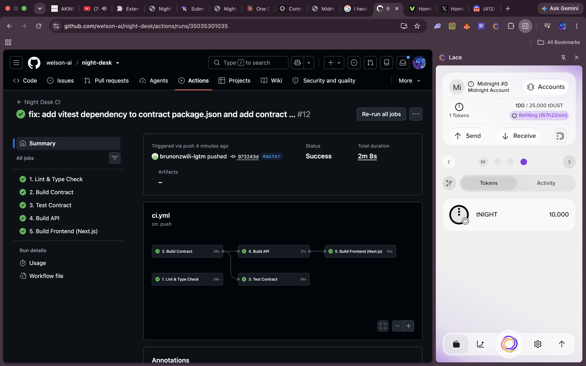

# Night Desk — Testing Strategy & Results

How the Night Desk codebase is verified: unit tests on the contract's private-state and witness machinery, type checking across the API, and a 5-job CI/CD pipeline that runs on every push and pull request.

## 1. Contract unit tests (Vitest)

The `contract/` workspace uses [Vitest](https://vitest.dev). Suites live in `contract/src/contract.test.ts`.

```bash
cd contract
npm test          # vitest run
```

### Current test suite (3 passing)

| # | Test | What it validates |
|---|---|---|
| 1 | `should create private state correctly` | `createNightDeskPrivateState(secretKey)` returns a well-formed private state holding the caller's 32-byte secret key — the foundation of all privacy guarantees. |
| 2 | `should create witnesses and return local secret key` | `createWitnesses().localSecretKey({ privateState })` returns the exact key that was put in, proving the witness plumbing used by the circuit's `localSecretKey()` is wired correctly. |
| 3 | `should have compiled contract defined as an object` | The compiled contract (`CompiledNightDeskContract` from `night-desk-contract`) is present and valid — verifying that `npm run compact` produced usable bindings. |

### Why these tests matter for a ZK dApp

- Privacy in Night Desk derives from **which inputs the circuit discloses**. The `localSecretKey` witness and the private state are the inputs to that decision, so a broken witness pipeline would silently change what a user is asked to sign.
- The compiled-contract check catches stale `managed/` artifacts early (e.g., after a `invoice.compact` change without recompiling), which in turn prevents the frontend from loading mismatched `.zkir` / `.bzkir` circuit files.

### Planned extensions

- Lifecycle-matrix tests for `acceptInvoice` / `settleInvoice` / `cancelInvoice` state transitions via the derived state.
- Negative-path tests (accepting a settled invoice, cancelling someone else's invoice).
- Property-based tests on the `Uint<64>` amount bounds.

## 2. Contract compilation (circuits listed)

Compiling the Compact contract produces the ZK circuits. From the repo root:

```bash
npm run compile    # cd contract && npm run compact
```

Successful output:

```
> night-desk-contract@0.1.0 compact
> compact compile invoice.compact managed/night-desk

Compiling 4 circuits:
```

The 4 circuits are emitted as `contract/managed/night-desk/zkir/*.zkir` / `*.bzkir` (plus `commit` artifacts under `keys/`):

```
acceptInvoice     .zkir / .bzkir
cancelInvoice     .zkir / .bzkir
createInvoice     .zkir / .bzkir
settleInvoice     .zkir / .bzkir
```

One artifact set per circuit is proof that each circuit in `invoice.compact` compiled successfully. The same compile step runs inside CI (`build-contract` job) and is also exercised by test #3, which asserts `CompiledNightDeskContract` is a valid object produced from these circuits.

## 3. API type checking

The `api/` workspace validates its TypeScript build against the contract types:

```bash
cd api
npm run build      # tsc emit + type checks (also run by CI)
```

## 4. CI/CD pipeline (`.github/workflows/ci.yml`)

Five independent jobs run on push to `master`/`main` and on pull requests:

| Job | Command | Purpose |
|---|---|---|
| 1. Lint & Type Check | `cd contract && npm run build` → `cd api && npm run build` | Catch type errors across the workspace. |
| 2. Build Contract | `cd contract && npm run build` | Compile contract + copy ZK assets to the frontend's `public/`. |
| 3. Test Contract | `cd contract && npm test` | Run the Vitest suite (depends on build-contract). |
| 4. Build API | `cd api && npm run build` | Validate the `InvoiceAPI` package (depends on build-contract). |
| 5. Build Frontend | `cd frontend-landing && npm run build` | Production Next.js build (depends on build-contract + build-api). |

Job ordering encodes a real dependency: `contract/` must be built before `api/` and `frontend-landing/`, because both consume `night-desk-contract` bindings. The `build-contract` job's copy step also guarantees the ZK `.zkir`/`keys` assets exist before the frontend build tries to reference them.



## 5. How a reviewer verifies the tests

1. Install dependencies: `npm install` (at the repo root).
2. Run the contract suite: `cd contract && npm test` — expect **3 passing**.
3. Trigger full verification the same way CI does: run the five jobs' commands above in order, or push to `master` and watch `.github/workflows/ci.yml` go green.

## 6. References

- `README.md` — Testing section and Support matrix
- `SUBMISSION.md` — Level 2/4 checklists referencing the 3+ passing tests